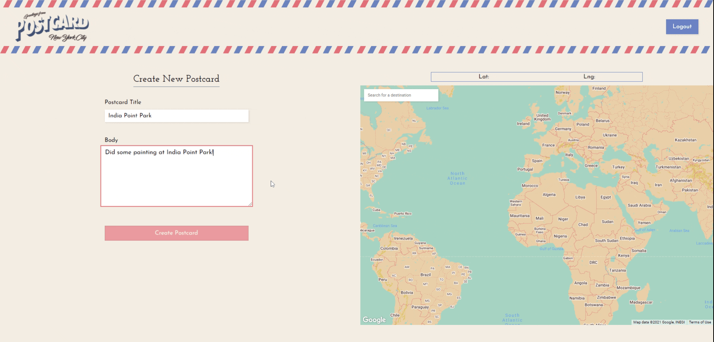
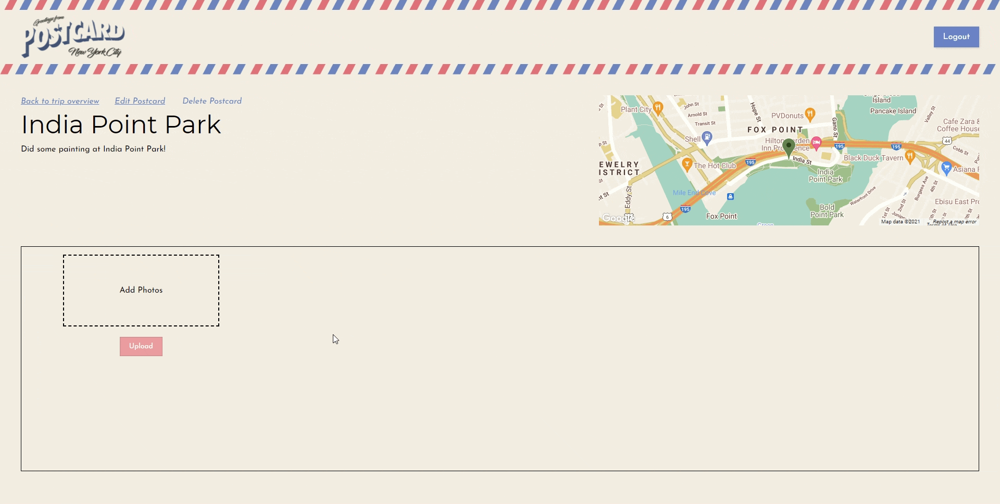

# <a href="https://postcard-triplog.herokuapp.com/#/" target="_blank">Postcard</a>

#### _The app for the person who loves to travel and keep a beautiful scrapbook of their travels. Users can view other users' travels and even follow their `Trips`!_

---

## **Postcard** is a MERN stack project

#### Technologies employed

- MongoDB
  - MongoDB is a general purpose, document-based, distributed database. Accessing it allows for much faster queries as opposed to a SQL database.
- ExpressJS
  - ExpressJS is a fast web framework facilitating the controller aspect of backend routing in a MERN stack app.
- ReactJS
  - A JavaScript library used for building fast, responsive, and interactive views for any kind of app.
- NodeJS
  - Node is used primarily as a runtime environment for a MERN stack to run a server. Also, it provides a lot of flexibility for building via the Node Package Manager (NPM) library installation feature.
- Google Maps API
  - Google Maps API allows developers to implement beautiful, interactive maps within their applications.
- Amazon Web Services
  - Amazon Web Services provides a gamut of services a developer may need. From photo storage to web app hosting, Amazon almost does it all. In this case, we only utilize the photo storage service.

---

## **Team Members**

### **Chris Joo**, <span style="font-size: 14px;">*Team-lead, flex*</span>
* [GitHub](https://github.com/chrisj1225) | [LinkedIn](https://www.linkedin.com/in/chrisj1225/)
### **Daniel Cho**, <span style="font-size: 14px;">*Back-end lead*</span>
* [GitHub](https://github.com/thedanielcho) | [LinkedIn](https://www.linkedin.com/in/daniel-cho-376110189/)
### **Freddy Diengott**, <span style="font-size: 14px;">*Front-end lead*</span>
* [GitHub](https://github.com/fdiengott) | [LinkedIn](https://www.linkedin.com/in/freddiengott/)
### **Tim Fraczak**, <span style="font-size: 14px;">*Flex magician*</span>
* [GitHub](https://github.com/tfraczak) | [LinkedIn](https://www.linkedin.com/in/timothy-fraczak-e-i-t-1393a183/)

---

## Feature highlights

### Implementation of Google Maps API

Google Maps wasn't terribly difficult to implement and get started, however, it was somewhat tricky to make the map interactive with the rest of the app because when the map loads it doesn't really load any HTML elements with easily "grabbable" properties. We envisioned the user being able to see a correlation on the map when selecting or interacting with other parts of the app. So, our solution to that was this:

```javascript
// event listeners for hovering the markers
marker.addListener("mouseover", e => {

});
marker.addListener("mouseout", e => {

});

// event listener for clicking the marker
marker.addListener("click", e => {

});

// event listeners for hovering the corresponding list item
document.getElementById(`trip-item-${trip._id}`)addEventListener("mouseenter", () =>{

});

document.getElementById(`trip-item-${trip._id}`).addEventListener("mouseleave", () =>{

});

```

As markers were being generated to be placed on the map, we would install listeners on the markers themselves as well as the corresponding elements that should have interactivity with their marker.


In addition to the maps interactivity, we also were able to implement a places search box allowing the user to search for a place they may have visited and select it on the map when creating or editing a `Postcard`.



<br>
<br>

### **Implementing AWS and styling the photos**

After implementing AWS, we thought it would be imperative to style the `Postcard` show page well for UI/UX. We enabled the user to upload multiple images at once for general quality of life enhancement so that a user doesn't have to upload one photo at a time.


As for image viewing, we think we knocked this out of the park. We added some styling transitions that really make the `Postcard` show page lively and interactive.


---

## Code highlights

## **Chris**

Workhorse for front-end state management and creating form components. He was the key person managing all the data on the front-end. There would be way too many code snippets to place here.

## **Freddy**

Implementing the photo cycling and image viewer on the `Postcard` show page.

```JavaScript
const { postcard, currentUser } = this.props;
    const { imgUrls, btnDisabled } = this.state;

    if (!postcard) return null;

    let imageUpload;
    let editPostcardLink;
    let deletePostcardButton;
    let imgPreviews;
    const isUsers = !!currentUser && currentUser._id === postcard.travellerId;
    if (isUsers) {
      imageUpload = (
        <form onSubmit={this.uploadImages} encType="multipart/form-data" >
          <div> {/* upload-box */}
            <input type="file" multiple
              onChange={this.handleChange} />
            <button type="submit">Upload</button>
          </div>
        </form>
      );

      const firstImgPreview = imgUrls.length ? (
        
      ) : null;

      imgPreviews = imgUrls.length > 1 ? (
        imgUrls.slice(1).map(imgUrl => (
          <li className="postcard-image-item-wrapper img-preview-wrapper">
            <div>
              
            </div>
          </li>
        ))
      ) : null;

      imageUpload = (
        <form
          onSubmit={this.uploadImages}
          encType="multipart/form-data"
          className="upload-image-form"
          >
          <label htmlFor="photo"
            onDragOver={this.handleDragOver}
            onDragEnter={this.handleDragEnter}
            onDragLeave={this.handleDragLeave}
            onDrop={this.handleDrop}
          >
            { firstImgPreview }
            <span>Add Photos</span>
            <input type="file" name='photo' id='photo' multiple
              onChange={this.handleChange} />
          </label>
          <button
            type="submit"
            className={btnDisabled ? "disabled" : "active"}
          >Upload</button>
        </form>
      )

      editPostcardLink = <Link className="edit-postcard" to={`/postcards/${postcard._id}/edit`}>Edit Postcard</Link>;

      deletePostcardButton = (
        <a onClick={this.deletePostcard}
          className="delete-postcard">Delete Postcard</a>
      );
    }

    const errors = this.state.errors ? (
      <ul role="list" className="errors">
        {
          this.state.errors.map(err => (
            <li>{err}</li>
          ))
        }
      </ul>
    ) : null;

    const imageComponents = this.props.postcard.photos.length < 8 ? (
      <>
        { imageUpload }
        { imgPreviews }
      </>
    ) : null;
```

## **Tim**

Implementing an interactive `Trips` index map on the landing page.

```JavaScript

// function that runs when Google Maps API has loaded

handleApiLoaded(map, maps) {
  this.map = map;
  this.maps = maps;

  if (this.tripsWithPos.length) {

    this.tripsWithPos.forEach(trip => {

      // if the trip has no postcards, lat-lng are > 180, so don't continue
      if (trip.lat > 180 || trip.lng > 180) return;

      // viewable trips
      this.trips.push(trip);

      // set up marker on map
      const position = { lat: trip.lat, lng: trip.lng };
      const marker = new maps.Marker({
        position,
        map,
        animation: maps.Animation.DROP,
        optimized: false,
        icon: redMarker,
        id: `trip-marker-${trip._id}`,
      });
      this.markers.push(marker);
      let desc;
      const limit = 20;
      if (trip.description.length > limit) {
        desc = limitChars(trip.description, limit);
      } else {
        desc = trip.description;
      }

      // setting up interactive events
      const content =
        '<div id="index-info-content-wrapper">' +
        '<h1 class="trip-title-info">' +
        `${trip.title}` + '</h1>' +
        '<p class="trip-desc-info">' +
        `${desc}` + '</p>' +
        '</div>';

      // create infowindow for the markers
      const infoWindow = new this.maps.InfoWindow({
        content
      });

      // event listener for hovering the markers
      marker.addListener("mouseover", e => {
        this.markers.forEach(m => m.setIcon(redMarker));
        marker.setIcon(greenMarker);
        infoWindow.open(map, marker);
        const tripItem = document.getElementById(`trip-item-${trip._id}`);
        tripItem.scrollIntoView({ behavior: "smooth", block: "center" });
        tripItem.classList.add("focused");
      });
      marker.addListener("mouseout", e => {
        infoWindow.close();
        const tripItem = document.getElementById(`trip-item-${trip._id}`);
        tripItem.classList.remove("focused");
      });

      // event listener for clicking the marker
      marker.addListener("click", e => {
        this.props.history.push(`/trips/${trip._id}`);
      });

      // event listeners for hovering the trips list item
      document.getElementById(`trip-item-${trip._id}`).addEventListener("mouseenter", () =>{
        let lat, lng, position;
        lat = marker.position.lat();
        lng = marker.position.lng();
        position = { lat,lng }
        this.markers.forEach(m => m.setIcon(redMarker));
        marker.setIcon(greenMarker);
        this.map.panTo(position);
        if (this.center !== position) {
          this.center = position;
          setTimeout(() => {
            this.map.setZoom(6);
          }, 200);
        } else {
          this.map.setZoom(6);
        }

        marker.setAnimation(this.maps.Animation.BOUNCE);
      });

      document.getElementById(`trip-item-${trip._id}`).addEventListener("mouseleave", () =>{
        marker.setAnimation(null);
        this.map.setZoom(0);
      });

      // add the marker to the array after we're done with it
      this.markers.push(marker);
    });
  }
}
```

## **Daniel**

Implementation of deleting an image in the back-end.

```JavaScript
// ./routes/api/postcards.js

router.put('/:id/deleteImage', passport.authenticate('jwt', {session: false}), async (req, res) => {
  const postcard = await Postcard.findById(req.params.id);

  if(!postcard){
    return res.status(404).json({ postcards: "Postcard not found"})
  }

  const trip = await Trip.findById(postcard.tripId)

  if(!trip){
    return res.status(404).json({trip: "Trip not found"})
  }

  const user = await User.findById(req.user.id)

  if(trip.travellerId != user.id){
    return res.status(401).json(
      {
        user: "You do not have permission to delete a photo from this postcard"
      }
    )
  }

  let bucket = req.body.imageUrl.split("/")[2].split(".")[0];
  let key = req.body.imageUrl.split("/")[3];

  deleteImage(bucket, key);

  let idx = postcard.photos.indexOf(req.body.imageUrl)
  postcard.photos.splice(idx, 1);
  postcard.save()
    .then((postcard) => {
      let postcardObj = {
        photos: postcard.photos,
        _id: postcard.id,
        title: postcard.title,
        body: postcard.body,
        tripId: postcard.tripId,
        lat: postcard.lat,
        lng: postcard.lng,
        createdAt: postcard.createdAt,
        updatedAt: postcard.updatedAt,
        __v: postcard.__v,
        travellerId: user.id
      }
      res.json(postcardObj)
    })
})

// ./services/imageDelete.js

const AWS = require("aws-sdk");
const multer = require("multer");
const multerS3 = require("multer-s3");
const keys = require('../config/keys');
const s3 = new AWS.S3({
  accessKeyId: keys.AWS.accessKeyId,
  secretAccessKey: keys.AWS.secretAccessKey,
});
const path = require('path')

const deleteImage = (bucket, key) => {

  let params = {
    Bucket: bucket,
    Key: key,
  }
  s3.deleteObject(params, (err, data) => {
    if(err){
      console.log(err)
    }
  });

}

module.exports = deleteImage;
```
---
## Conclusion

We were able to implement one of our bonus features: `Follows`. This feature allows a user to filter their `Trips` index to only those they are following.

Possible bonus features:
* Drag and drop image upload.
* Adding friends.
* Adding more filters, such as by country.
* Privacy settings for `Trips`.
